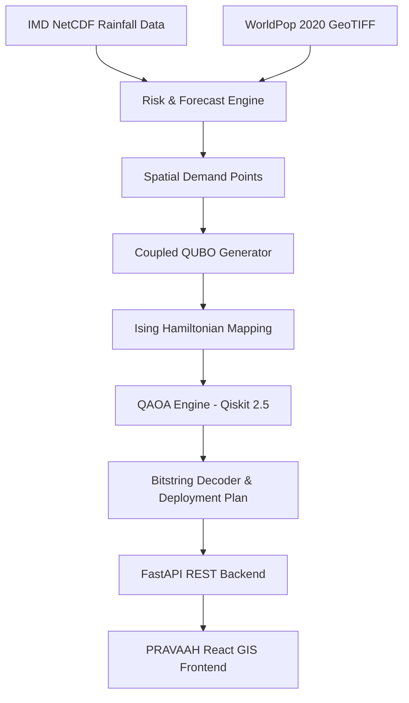

# PRAVAAH

> **Flood Intelligence & Response Optimization**  
> A quantum-optimized flood forecasting and disaster-response sensor placement platform for the Krishna–Godavari region.

---

## 🌊 Project Overview

**PRAVAAH** is an end-to-end decision-support platform designed to transform multi-source hydro-meteorological data into actionable, connected disaster-response infrastructure deployments.

Instead of operating solely as a static flood dashboard, PRAVAAH couples high-resolution meteorological forecasts and geospatial settlement exposure into a **Quadratic Unconstrained Binary Optimization (QUBO)** problem. The formulation is mapped to an **Ising Hamiltonian** and solved using **Quantum Approximate Optimization Algorithm (QAOA)** simulation to determine optimal sensor locations and wireless relay mast placements under budget and connectivity constraints.

### Core Pipeline
```
Precipitation & Population Data
           ↓
Flood Risk Assessment
           ↓
Spatial Response Demand
           ↓
Candidate Sensor & Relay Network
           ↓
QUBO Matrix Formulation
           ↓
Ising Model Mapping
           ↓
QAOA Optimization (Qiskit 2.5)
           ↓
Selected Sensors & Relay Placement
           ↓
Risk-Weighted Coverage & Connectivity
           ↓
Disaster Response Command Support
```

---

## 💡 Why PRAVAAH?

Flood-prone river deltas face severe monitoring resource constraints. Disaster response authorities cannot place sensors at every geographic point due to capital, maintenance, and communications limitations.

The core challenge is not merely detecting flood risk, but determining:
- **Where** monitoring sensors should be deployed to maximize risk coverage.
- **How** limited sensor assets can cover high-density population areas.
- **Where** wireless communication relays must be placed so that every active sensor maintains line-of-sight reachability.
- **How** forecasted risk dynamically shifts infrastructure priorities.

Balancing sensor coverage, relay transmission limits, budget caps ($K_{\text{max}}, M_{\text{max}}$), and penalty terms for disconnected nodes forms a hard combinatorial optimization problem, motivating a coupled QUBO and QAOA approach.

---

## ⚡ Core Capabilities

- **Hydro-Meteorological Risk Assessment**: Evaluates 0.25° gridded daily rainfall series coupled with population settlement grids.
- **Spatial Demand Generation**: Translates composite risk scores and population exposure counts into continuous demand weights.
- **Coupled Sensor & Relay Placement**: Jointly optimizes sensor site selection and wireless relay mast placement.
- **QUBO & Ising Formulation**: Mathematically models coverage rewards, budget constraints, and disconnected node penalties.
- **QAOA Solver Simulation**: Solves the coupled formulation using Qiskit 2.5 Statevector simulation across variational ansatz depths ($p=1, 2, 3$).
- **Classical Baseline Comparison**: Benchmarks QAOA solution quality against Exact Integer Linear Programming (ILP) and Classical Greedy heuristics.
- **Interactive GIS Network Map**: Visualizes river channels, candidate anchor sites, active deployments, wireless links, and coverage radii using MapLibre GL.
- **Operational Command & Warning HUD**: Provides active flood warning alerts and simulated emergency dispatch channel tracking.

---

## 🛠️ Technology Stack

### Frontend
- **Framework**: React 19, TanStack Start, TanStack Router
- **Build Tool**: Vite 6, `@tailwindcss/vite` (Tailwind CSS v4)
- **UI Components**: Vanilla CSS design tokens, shadcn/ui, Lucide React icons
- **Mapping & Charts**: MapLibre GL 4.7, Recharts 2.15

### Backend & Analytics
- **API Framework**: Python 3.10+, FastAPI, Uvicorn
- **Data Science**: NumPy, Pandas, xarray, NetCDF4, Rasterio

### Quantum Computing & Optimization
- **SDK**: Qiskit 2.5 Statevector Simulator
- **Formulation**: QUBO Matrix ($8 \times 8$), Ising Spin Transformation ($Z_i \in \{+1, -1\}$)
- **Algorithms**: QAOA (Variational Ansatz), Exact ILP Solver, Greedy Heuristic

---

## 📐 System Architecture



---

## 📁 Project Structure

```
.
├── backend/
│   ├── app/
│   │   ├── api/             # REST endpoints (risk, forecast, optimization, alerts)
│   │   ├── forecasting/     # Rainfall risk breakdown & scenario models
│   │   ├── optimization/    # Coupled QUBO formulation, Ising mapping & QAOA solver
│   │   ├── response/        # Demand point generation & alert rules
│   │   ├── main.py          # FastAPI application entry point
│   │   └── config.py        # System configuration & dataset paths
│   ├── data/
│   │   ├── raw/             # Excluded raw datasets (geospatial & rainfall)
│   │   └── sample/          # Prepackaged candidate & basin geometry GeoJSON
│   └── tests/               # Backend unit & integration test suite
├── src/
│   ├── components/          # Reusable UI cards, maps, navigation & circuit visualizer
│   ├── lib/                 # API client, theme provider & basin context
│   ├── routes/              # TanStack Router page views (Overview, Forecast, Quantum, Network, Response)
│   └── styles.css           # Global PRAVAAH design system tokens & Tailwind v4
├── package.json
├── vite.config.ts
└── README.md
```

---

## 💾 Dataset Setup

> [!IMPORTANT]
> **Raw Dataset Exclusion**: Large raw geospatial raster (`.tif`) and gridded rainfall (`.nc`) files are **intentionally excluded from Git tracking** to maintain a lightweight repository. They must be downloaded and placed locally before executing the data processing backend.

### Required Directory Hierarchy

Create the following local directory structure under `backend/data/raw/`:

```
backend/
└── data/
    └── raw/
        ├── geospatial/
        │   └── ind_ppp_2020_UNadj_constrained.tif
        └── rainfall/
            ├── RF25_ind1981_rfp25.nc
            ├── RF25_ind1986_rfp25.nc
            ├── RF25_ind2022_rfp25.nc
            ├── RF25_ind2023_rfp25.nc
            ├── RF25_ind2024_rfp25.nc
            └── RF25_ind2025_rfp25.nc
```

### Dataset File Summary

| File Name | Purpose | Format | Expected Location |
| :--- | :--- | :--- | :--- |
| `ind_ppp_2020_UNadj_constrained.tif` | WorldPop 2020 UN-Adjusted Population Density (100m grid) | GeoTIFF | `backend/data/raw/geospatial/` |
| `RF25_ind1981_rfp25.nc` ... `RF25_ind2025_rfp25.nc` | IMD High-Resolution Daily Gridded Rainfall (0.25° × 0.25°) | NetCDF4 | `backend/data/raw/rainfall/` |

*Download the corresponding datasets from their official open-data repositories (IMD Pune / WorldPop Open Data) and save them using the exact filenames listed above.*

---

## 🚀 Installation & Setup

### Prerequisites
- **Node.js**: v18.0 or higher
- **Python**: v3.10 or higher
- **npm** or **bun**

### 1. Backend Setup

```bash
# Navigate to backend directory
cd backend

# Create Python virtual environment
python -m venv .venv

# Activate virtual environment (Windows PowerShell)
.\.venv\Scripts\Activate.ps1
# (Linux/macOS: source .venv/bin/activate)

# Install required Python dependencies
pip install fastapi uvicorn qiskit numpy pandas xarray netcdf4 rasterio
```

### 2. Frontend Setup

```bash
# From project root
npm install
```

---

## 🏃 Running the Application

Running PRAVAAH requires starting both the FastAPI backend service and the Vite React frontend client.

### Step 1: Start FastAPI Backend
```bash
cd backend
python -m uvicorn app.main:app --reload --port 8000
```
*API docs will be available at `http://localhost:8000/docs` and health check at `http://localhost:8000/health`.*

### Step 2: Start Vite Frontend Client
Open a second terminal window from project root:
```bash
npm run dev
```
*The PRAVAAH web application will launch at `http://localhost:3000`.*

---

## ⚛️ Quantum Optimization Details

The sensor and relay placement problem is formulated as a Quadratic Unconstrained Binary Optimization (QUBO) problem over $N$ sensor candidate variables $x_i \in \{0, 1\}$ and $M$ relay candidate variables $y_j \in \{0, 1\}$ ($N+M=8$ qubits in prototype):

$$\min_{x,y} H(x,y) = -\sum_{i=1}^N w_i r_i x_i + \lambda_S \left(\sum_{i=1}^N x_i - K\right)^2 + \lambda_R \left(\sum_{j=1}^M y_j - M_{\text{relay}}\right)^2 + C_{\text{disc}} \cdot \text{Disc}(x,y)$$

### Optimization Pipeline
1. **QUBO Matrix**: $8 \times 8$ symmetric matrix encoding coverage rewards and penalty terms.
2. **Ising Conversion**: Spin substitution $x_i = \frac{1 - Z_i}{2}, y_j = \frac{1 - Z_j}{2}$ yielding longitudinal fields $h_i$ and pairwise couplings $J_{ij}$.
3. **QAOA Ansatz**: Statevector simulation initialized to $|+\rangle^{\otimes 8}$ followed by parameter optimization ($\gamma, \beta$).
4. **Bitstring Decoding**: High-probability bitstrings (e.g. `10101111`) are mapped back to physical sensor site IDs and relay mast locations.

### Classical Benchmark Summary

| Solver Method | Type | Objective Score | Approx Ratio | Optimality Gap |
| :--- | :--- | :--- | :--- | :--- |
| **Exact ILP Solver** | Classical Ground Truth | 415.5 | 100.0% | 0.00% |
| **QAOA (Depth p=2)** | Qiskit Statevector | 414.2 | 99.68% | 0.31% |
| **QAOA (Depth p=1)** | Qiskit Statevector | 412.5 | 99.29% | 0.71% |
| **Greedy Baseline** | Classical Heuristic | 382.1 | 91.96% | 8.04% |

---

## 📌 Prototype Scope & Notes

- **Predefined Candidate Anchor Sites**: Candidate sensor and relay locations are currently predefined anchor sites in the Krishna and Godavari delta basins.
- **Qiskit Statevector Simulation**: QAOA circuits are simulated locally via Qiskit 2.5 Statevector simulation; no physical quantum hardware or quantum speedup is claimed for the 8-qubit formulation.
- **Simulated Warning Channels**: Emergency notification channels (SDMA Email Dispatch, WhatsApp Emergency) are UI/prototype demonstrations.
- **River Discharge Telemetry**: Direct river gauge discharge telemetry is marked unavailable when live gauge feeds are offline.

---

## 🔮 Future Scope

- Integration with live telemetry river gauge APIs (CWC / State Water Resources).
- Dynamic spatial candidate generator with DEM slope and hydraulic stream routing.
- Execution of QAOA circuits on IBM Quantum hardware backends via Qiskit Runtime.
- Live WebHook integration for SDMA emergency broadcast dispatch.
